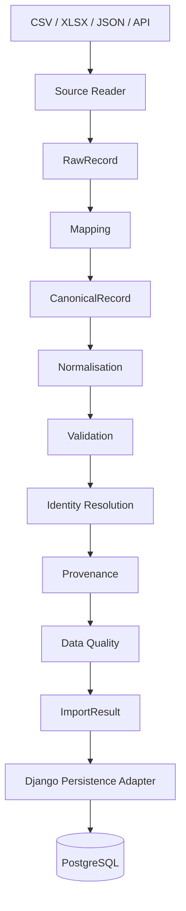
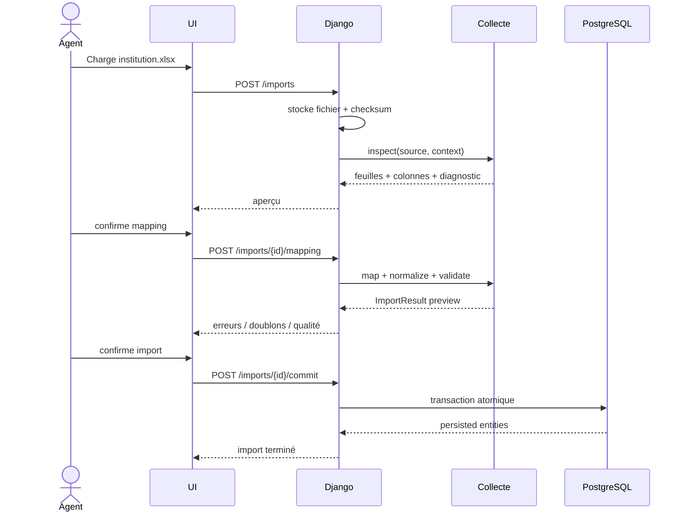
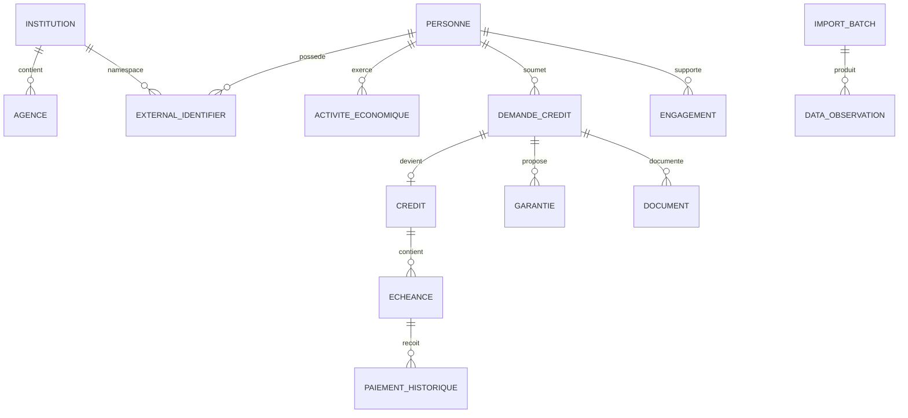

# CREDIBILIS — Architecture complète de l'application métier

> **Document principal d'architecture.**  
> Toute personne ou tout agent IA qui travaille sur CREDIBILIS doit lire ce fichier avant de modifier le projet.

---

## 0. Objet de ce document

CREDIBILIS n'est pas seulement un modèle de scoring. Le produit cible est une **application métier d'aide à la décision de crédit pilotée par les données**.

L'application doit être capable de :

1. recevoir des données provenant de formulaires, CSV, Excel, JSON et plus tard d'API institutionnelles ;
2. comprendre des structures différentes selon l'institution ;
3. identifier correctement les entités (client, entreprise, crédit, échéance, paiement, etc.) ;
4. normaliser les données dans un schéma canonique ;
5. conserver la provenance et la qualité de chaque information importante ;
6. persister ces informations de façon sûre avec Django/PostgreSQL ;
7. reconstruire un dossier de crédit au moment T0 ;
8. appliquer les cadres d'analyse métier configurables ;
9. fabriquer les variables nécessaires au moteur statistique ;
10. appeler le moteur Data Science ;
11. restituer score, estimation, explications et simulations ;
12. laisser la décision finale au processus humain de l'institution.

Ce document décrit **l'architecture cible complète**, même si la première implémentation se concentre sur le moteur de collecte.

---

# 1. État actuel vs architecture cible

## 1.1 Ce qui existe réellement aujourd'hui

Le dépôt contient principalement :

```text
CREDIBILIS/
├── ds_engine/
│   ├── cohort_engine.py
│   ├── credibility.py
│   ├── buhlmann.py
│   ├── predictor.py
│   ├── train_models.py
│   ├── ontology.py
│   ├── graph_engine.py
│   ├── explainability.py
│   └── ...
├── donnees_fictives_credibilis.csv
├── docs/
└── README.md
```

Le moteur Data Science est **expérimental** et utilise actuellement des données synthétiques. Il ne constitue pas, à lui seul, l'application métier.

## 1.2 Ce que nous construisons

L'architecture cible est :

```text
                       UTILISATEURS
            Agent / Superviseur / Administrateur
                              |
                              v
                    FRONTEND / INTERFACE
                              |
                              v
                    DJANGO + DRF (API)
                              |
             +----------------+----------------+
             |                                 |
             v                                 v
      APPLICATION MÉTIER                  ADAPTATEURS
   dossiers / workflow / audit        fichiers / DB / API
             |                                 |
             +----------------+----------------+
                              |
                              v
                  MOTEURS PYTHON INDÉPENDANTS
                              |
      +-----------+-----------+-----------+-----------+
      |           |           |           |           |
      v           v           v           v           v
   Collecte    Analyse      Features    Scoring    Explication
                              |
                              v
                          ds_engine
                              |
                              v
                    AIDE À LA DÉCISION
                              |
                              v
                     DÉCISION HUMAINE
```

---

# 2. Principe d'architecture fondamental

## 2.1 Django est l'hôte, pas le cerveau

Django sert à :

- exposer les URLs ;
- recevoir les requêtes HTTP ;
- gérer les utilisateurs et permissions ;
- gérer les fichiers uploadés ;
- persister les données avec l'ORM ;
- utiliser PostgreSQL ;
- gérer les transactions ;
- exposer l'API REST ;
- orchestrer les cas d'usage ;
- fournir l'administration et l'audit.

Django **ne doit pas contenir la logique centrale** de :

- mapping de colonnes ;
- normalisation ;
- identification des entités ;
- rapprochement de doublons ;
- qualité des données ;
- calcul de provenance ;
- feature engineering ;
- logique statistique du scoring.

## 2.2 Les moteurs métier sont du Python indépendant

La règle de dépendance est :

```text
Django  --->  moteurs Python

moteurs Python  -X->  Django
```

Un moteur Python doit pouvoir être testé depuis :

```bash
pytest packages/collecte/tests/
```

sans :

```text
DJANGO_SETTINGS_MODULE
serveur Django
ORM Django
DRF
```

## 2.3 Style retenu

Nous suivons une architecture proche de :

- **Hexagonal Architecture** ;
- **Ports & Adapters** ;
- séparation domaine / application / infrastructure.

L'objectif n'est pas d'appliquer ces patterns de façon académique, mais de garantir l'indépendance des composants.

---

# 3. Architecture cible du dépôt

```text
CREDIBILIS/
│
├── README.md
├── AGENTS.md
├── pyproject.toml                  # futur point d'entrée Python monorepo
│
├── docs/
│   ├── 00_ARCHITECTURE_COMPLETE.md
│   ├── 01_DECISIONS_ARCHITECTURE.md
│   ├── 02_ARCHITECTURE_MODULES.md
│   ├── 03_MOTEUR_COLLECTE.md
│   ├── 04_MODELE_DONNEES_CANONIQUE.md
│   ├── 05_IDENTITE_RAPPROCHEMENT.md
│   ├── 06_IMPORT_MAPPING_QUALITE_PROVENANCE.md
│   ├── 07_DJANGO_PERSISTENCE_API.md
│   ├── 08_INTEGRATION_DS_ENGINE.md
│   ├── 09_SECURITE_AUDIT_MULTI_INSTITUTION.md
│   ├── 10_TESTS_OBSERVABILITE.md
│   ├── 11_PLAN_ATTAQUE.md
│   ├── 12_CONTRATS_INTER_MODULES.md
│   ├── 13_WORKFLOW_AGENTS_EQUIPE.md
│   ├── 14_ETAT_ACTUEL_VS_CIBLE.md
│   └── 15_GLOSSAIRE.md
│
├── packages/
│   ├── collecte/
│   │   ├── pyproject.toml
│   │   ├── credibilis_collecte/
│   │   │   ├── domaine/
│   │   │   ├── contrats/
│   │   │   ├── lecteurs/
│   │   │   ├── mapping/
│   │   │   ├── normalisation/
│   │   │   ├── validation/
│   │   │   ├── identite/
│   │   │   ├── rapprochement/
│   │   │   ├── provenance/
│   │   │   ├── qualite/
│   │   │   ├── exportation/
│   │   │   └── services/
│   │   └── tests/
│   │
│   ├── analyse_metier/             # phase suivante
│   ├── feature_engine/             # phase suivante
│   └── scoring_bridge/             # adaptateur vers ds_engine
│
├── backend/
│   ├── manage.py
│   ├── config/
│   └── apps/
│       ├── accounts/
│       ├── institutions/
│       ├── ingestion/
│       ├── identities/
│       ├── dossiers/
│       ├── documents/
│       ├── analyses/
│       ├── decisions/
│       └── audit/
│
├── frontend/                       # React/TypeScript cible
│
├── ds_engine/                      # moteur Data Science existant
│
├── tests/
│   ├── integration/
│   └── e2e/
│
└── docker-compose.yml
```

Cette structure est **cible**. Elle doit être introduite progressivement afin de ne pas casser le travail existant.

---

# 4. Modules fonctionnels de l'application

L'application complète est découpée en modules indépendants.

## Module A — Collecte de données

Responsabilité : transformer les données brutes en données canoniques fiables.

Sous-capacités :

```text
Import
Mapping
Normalisation
Validation
Identification
Rapprochement
Provenance
Data Quality
Export
```

C'est la priorité actuelle.

## Module B — Dossier de crédit

Responsabilité : représenter le dossier métier à T0.

Contient notamment :

- demandeur ;
- ménage ;
- activité économique ;
- revenus ;
- charges ;
- dettes ;
- demande de crédit ;
- garanties ;
- pièces ;
- historique pertinent ;
- états de validation.

Il ne s'agit pas d'un formulaire unique. Les parcours peuvent varier selon :

- PME ;
- salarié ;
- agriculture ;
- élevage ;
- artisan ;
- autres secteurs.

## Module C — Analyse métier configurable

Responsabilité : appliquer les méthodes de calcul de l'institution.

Exemples :

```text
marge disponible
capacité de remboursement
ratio couverture dette
solvabilité
quotité cessible
couverture garantie
```

Ces formules ne doivent pas être codées en dur dans les vues Django.

Les institutions peuvent avoir :

- des rubriques différentes ;
- des formules différentes ;
- des seuils différents ;
- des politiques différentes.

## Module D — Feature Engine

Responsabilité : construire des variables à partir des données canoniques et de l'historique.

Exemples :

```text
ancienneté activité
nombre de crédits précédents
retard maximal
nombre d'impayés
taux de remboursement historique
volatilité revenus
ratio dette/revenu
stabilité activité
```

Il fabrique un **snapshot de features** versionné.

## Module E — Scoring / Data Science

Responsabilité : produire une estimation statistique.

Le moteur actuel se trouve dans `ds_engine/`.

Il peut contenir :

- cohortes ;
- crédibilité ;
- modèles statistiques ;
- calibration ;
- estimation du risque ;
- simulations.

Le moteur statistique n'est pas la politique de crédit.

## Module F — Explicabilité

Responsabilité : expliquer les éléments qui ont influencé l'analyse.

Il faut distinguer :

- explication métier déterministe ;
- explication du modèle statistique ;
- qualité des données ;
- provenance des variables.

## Module G — Workflow de décision

Responsabilité : orchestrer la décision humaine.

Exemple :

```text
Agent de crédit
      |
      v
Analyse
      |
      v
Superviseur
      |
      v
Comité de crédit
      |
      v
Décision institutionnelle
```

Le moteur statistique peut aider ce workflow, mais ne doit pas masquer les responsabilités humaines.

## Module H — Audit et gouvernance

Responsabilité : répondre à :

```text
Qui ?
A fait quoi ?
Quand ?
Sur quelles données ?
Avec quelle version du mapping ?
Avec quelle version du modèle ?
Avec quelle politique ?
```

---

# 5. Architecture du moteur de collecte

## 5.1 Vue générale



## 5.2 Les étapes

### A. Lecture

Le lecteur ne comprend pas encore le métier.

Il sait seulement produire :

```text
RawRecord
- source
- feuille
- numéro de ligne
- colonnes brutes
- métadonnées
```

### B. Mapping

Le mapping traduit :

```text
"Nom client"          -> personne.nom_complet
"Téléphone"           -> personne.telephone
"CA mensuel"          -> activite.chiffre_affaires_mensuel
"Solde crédit"        -> engagement.solde_restant
```

### C. Normalisation

Exemples :

```text
"150 000"    -> 150000
"01/09/26"   -> date
"76 12 34 56" -> téléphone normalisé
"Oui"        -> True
```

### D. Validation

Exemples :

```text
revenu < 0                          -> erreur
naissance dans le futur            -> erreur
durée crédit = 0                   -> erreur
téléphone absent                   -> avertissement selon contexte
identifiant institution dupliqué   -> erreur / blocage
```

### E. Identité / Rapprochement

Le moteur cherche si le record correspond à une entité connue.

Résultats possibles :

```text
EXACT
PROBABLE
AMBIGU
AUCUN
```

### F. Provenance

Chaque information critique doit pouvoir dire d'où elle vient.

### G. Qualité

Le moteur produit un rapport :

```text
complétude
validité
unicité
cohérence
fraîcheur
niveau de vérification
```

### H. ImportResult

Le moteur ne persiste pas directement via Django.

Il retourne un résultat structuré que l'adaptateur Django peut confirmer et persister.

---

# 6. Cycle complet d'un import



---

# 7. Schéma canonique

Les colonnes d'un fichier externe ne deviennent jamais directement des colonnes métier du système.

Le schéma canonique est le langage commun de CREDIBILIS.

## 7.1 Entités principales

```text
Institution
Agence
Utilisateur
Personne
Organisation
ActiviteEconomique
Menage
DemandeCredit
Credit
Echeance
PaiementHistorique
Engagement
Garantie
Document
ExternalIdentifier
ImportBatch
MappingProfile
DataObservation
DataIssue
AuditEvent
```

## 7.2 Relations simplifiées



---

# 8. Identité et unicité

## 8.1 Identifiant interne

Chaque entité reçoit un identifiant interne CREDIBILIS.

Exemple :

```text
person_id = UUID
```

Cet identifiant est sous le contrôle de CREDIBILIS.

## 8.2 Identifiants externes

Exemple :

```text
institution = KAFO
entity_type = PERSONNE
identifier_type = compte_membre
value = 00487291
```

Un numéro de client n'est jamais supposé unique globalement.

La contrainte conceptuelle est :

```text
UNIQUE(
  institution,
  entity_type,
  identifier_type,
  value
)
```

## 8.3 Rapprochement

Règle : ne jamais fusionner deux personnes uniquement parce que leurs noms se ressemblent.

Les signaux sont classés :

```text
FORTS
- identifiant institutionnel exact
- numéro de pièce exact

MOYENS
- téléphone + date naissance
- compte + institution

FAIBLES
- nom/prénom
- quartier
- activité
```

Une correspondance faible devient une proposition de rapprochement, pas une fusion automatique.

---

# 9. Provenance : une valeur n'est jamais seulement une valeur

CREDIBILIS doit distinguer :

```text
650 000 FCFA déclaré par le client
650 000 FCFA lu dans un registre
650 000 FCFA importé du Core Banking
650 000 FCFA calculé par une formule
650 000 FCFA vérifié par un agent
```

Objet conceptuel :

```text
DataObservation
- entity_id
- canonical_field
- value
- source_kind
- source_reference
- institution_id
- import_batch_id
- collected_at
- collected_by
- verification_level
- evidence_document_id
- transformation_history
- schema_version
```

La provenance est essentielle pour :

- l'audit ;
- la qualité ;
- la confiance ;
- le scoring ;
- la reproductibilité.

---

# 10. Data Quality

## 10.1 Une anomalie est un objet structuré

```text
DataIssue
- code
- severity
- field
- raw_value
- normalized_value
- entity_reference
- message
- rule_id
- source_reference
```

Sévérités :

```text
INFO
WARNING
ERROR
BLOCKING
```

## 10.2 Dimensions qualité

```text
Complétude
Validité
Unicité
Cohérence
Fraîcheur
Traçabilité
Vérification
```

Le moteur doit produire un **quality summary**, pas seulement lever une exception.

---

# 11. Django et PostgreSQL

## 11.1 Rôle de Django

Django transforme les contrats du moteur en persistance réelle.

```text
ImportResult
    |
    v
Django Application Service
    |
    v
transaction.atomic()
    |
    v
ORM
    |
    v
PostgreSQL
```

## 11.2 Apps Django cibles

```text
accounts
institutions
ingestion
identities
dossiers
documents
analyses
decisions
audit
```

Chaque app doit rester concentrée sur son domaine.

## 11.3 Multi-institution

V1 : base PostgreSQL commune avec `institution_id` dans les données concernées.

Chaque requête métier doit être scindée par contexte institutionnel.

Ne jamais se fier à un identifiant fourni par le frontend pour autoriser l'accès à une autre institution.

---

# 12. API REST

Le backend est API-first.

## 12.1 Import

```text
POST /api/v1/imports/
GET  /api/v1/imports/{id}/
GET  /api/v1/imports/{id}/preview/
POST /api/v1/imports/{id}/mapping/
POST /api/v1/imports/{id}/validate/
POST /api/v1/imports/{id}/commit/
GET  /api/v1/imports/{id}/issues/
```

## 12.2 Entités

```text
GET /api/v1/entities/{id}/
GET /api/v1/entities/{id}/identifiers/
GET /api/v1/entities/{id}/provenance/
GET /api/v1/entities/{id}/history/
```

## 12.3 Export

```text
POST /api/v1/exports/
GET  /api/v1/exports/{id}/
```

## 12.4 Dossiers

Plus tard :

```text
POST /api/v1/credit-applications/
GET  /api/v1/credit-applications/{id}/
POST /api/v1/credit-applications/{id}/analyse/
POST /api/v1/credit-applications/{id}/score/
POST /api/v1/credit-applications/{id}/decision/
```

---

# 13. Relation avec le Frontend (React SPA Découplée)

## 13.1 Décision Fondatrice : Zéro Django Templates, Zéro HTMX, Zéro Alpine
Le frontend de CREDIBILIS est **strictement découplé** du backend. Django n'effectue aucun rendu HTML côté serveur.

```text
                FRONTEND
        React + TypeScript + Vite
        Tailwind CSS + shadcn/ui
                  │
                  │ HTTPS / JSON (/api/v1/...)
                  ▼
             DJANGO + DRF
                  │
      ┌───────────┼────────────┐
      │           │            │
      ▼           ▼            ▼
 Auth/RBAC      API        Services métier
      │                        │
      └────────────┬───────────┘
                   ▼
         ADAPTATEURS DJANGO
                   │
         ┌─────────┴─────────┐
         ▼                   ▼
   PostgreSQL          Object Storage
                             │
                             ▼
                 documents / fichiers

                   +
                   │
                   ▼
       MOTEURS PYTHON INDÉPENDANTS
       ┌───────────────────────────┐
       │ credibilis_collecte      │
       │ analyse métier           │
       │ feature engine           │
       │ scoring bridge           │
       └───────────────────────────┘
                   │
                   ▼
               ds_engine
```

## 13.2 Stack Technologique Frontend
* **Core & Build** : React 18+, TypeScript, Vite
* **Styling & Composants** : Tailwind CSS, shadcn/ui (Radix UI primitives)
* **Routage** : React Router v6
* **Gestion des Données Serveur & Cache** : TanStack Query (React Query)
* **Gestion des Tables Complexes** : TanStack Table (pour les listes d'imports, anomalies, clients, doublons, audit)
* **Formulaires & Validation UX** : React Hook Form, Zod
* **Dataviz & Graphiques** : Recharts (jauges 3-tiers, histogrammes de cohortes, ratios d'effort)

## 13.3 Structure Interne du Frontend
```text
frontend/
├── src/
│   ├── app/                    # Configuration globale, providers, theme
│   ├── api/                    # Client HTTP (Axios/Fetch), interceptors JWT, contrats
│   ├── components/             # Composants réutilisables (shadcn/ui : buttons, modals, cards)
│   ├── features/               # Modules fonctionnels découpés par domaine
│   │   ├── dashboard/          # Vue d'ensemble agents et superviseurs
│   │   ├── collecte/           # Formulaire interactif et wizard d'instruction
│   │   ├── clients/            # Fiches d'entités canoniques
│   │   ├── dossiers/           # Instruction de crédits, simulation d'offres
│   │   ├── imports/            # Ingestion de fichiers, inspection, validation
│   │   ├── mapping/            # Interface de réconciliation des colonnes sources
│   │   ├── qualite/            # Tableaux de bord Data Quality & anomalies
│   │   ├── rapprochement/      # Résolution manuelle des doublons et ambiguïtés
│   │   ├── documents/          # Visionneuse et téléversement de justificatifs
│   │   ├── exports/            # Déclencheur et téléchargement d'exports
│   │   └── audit/              # Journal des événements légaux et traçabilité
│   ├── hooks/                  # Hooks réutilisables (useDebounce, useAuth, etc.)
│   ├── lib/                    # Utilitaires (formatage devises FCFA, dates, calculs locaux)
│   ├── routes/                 # Définition des routes et gardes d'authentification
│   └── types/                  # Déclarations TypeScript alignées sur les schémas OpenAPI
├── package.json
└── vite.config.ts
```

## 13.4 Flux d'Ingestion Interactif (Import de Fichier)
```text
React SPA                                  Django DRF                     credibilis_collecte
   │                                            │                                  │
   │── POST multipart (/api/v1/imports/) ──────>│                                  │
   │                                            │── Stockage physique temporaire   │
   │                                            │── Appel moteur inspection ──────>│
   │                                            │<─ ImportResult (feuilles, cols)──│
   │<─ 201 Created (uuid, résumé source) ───────│                                  │
   │                                            │                                  │
   │── GET /api/v1/imports/{uuid}/schema ──────>│ (Renvoie colonnes détectées)     │
   │── GET /api/v1/imports/{uuid}/mapping ─────>│ (Suggestions automatiques)       │
   │                                            │                                  │
   │   [L'utilisateur ajuste le mapping en UI]  │                                  │
   │── PUT /api/v1/imports/{uuid}/mapping ─────>│ (Sauvegarde le mapping ajusté)   │
   │                                            │                                  │
   │── POST /api/v1/imports/{uuid}/validate ───>│── Exécution validation ─────────>│
   │<─ Résumé (valides, anomalies, blocages) ───│<─ Diagnostic Data Quality ───────│
   │                                            │                                  │
   │── GET /api/v1/imports/{uuid}/matches ─────>│── Calcul des rapprochements ────>│
   │<─ Doublons probables / ambigus ────────────│<─ Liste candidats ───────────────│
   │                                            │                                  │
   │   [Résolution manuelle par l'agent]        │                                  │
   │── POST /api/v1/matches/{id}/resolve ──────>│ (SAME_ENTITY / DIFFERENT_ENTITIES)
   │                                            │                                  │
   │── POST /api/v1/imports/{uuid}/commit ─────>│── Transaction atomique ORM ─────>│ (PostgreSQL)
   │<─ 200 OK (Import finalisé) ────────────────│                                  │
```

## 13.5 Collecte Terrain : Wizard 10 Étapes et Autosave
Pour l'instruction en agence ou sur le terrain, React orchestre un wizard en 10 étapes distinctes :
1. **Étape 1 : Identité** (Nom, prénom, surnom, contact, pièces d'identité)
2. **Étape 2 : Consentement** (Accord légal de traitement des données personnelles)
3. **Étape 3 : Ménage** (Composition familiale, personnes à charge, statut logement)
4. **Étape 4 : Activité** (Secteur, commerce, ancienneté, emplacement)
5. **Étape 5 : Revenus & Charges** (Chiffre d'affaires, dépenses régulières, saisonnalité)
6. **Étape 6 : Dettes & Engagements** (Encours bancaires, tontines, dettes fournisseurs)
7. **Étape 7 : Demande de Crédit** (Montant, objet, durée souhaitée, périodicité)
8. **Étape 8 : Garanties** (Cautions morales, gages matériels, nantissements)
9. **Étape 9 : Documents & Pièces** (Photos justificatives, relevés Mobile Money)
10. **Étape 10 : Vérification Finale & Synthèse** (Audit trail et soumission au scoring)

### Mécanisme d'Autosave :
* Saisie utilisateur en continu.
* Déclenchement automatique via **debounce (ex: 800ms)** sans bouton de soumission bloquant.
* Requête `PATCH /api/v1/dossiers/{uuid}` orchestrée par une mutation TanStack Query.
* Indicateur visuel d'état discret : *"Enregistrement..."* $\rightarrow$ *"✓ Enregistré à 14:02"*.

## 13.6 Règle de Répartition des Validations (Zod vs Backend)
* **Zod (Frontend)** : Améliore le confort et la réactivité de l'UX (vérification immédiate du format du numéro de téléphone, obligation de remplissage, bornes numériques simples).
* **Services Applicatifs & Moteurs (Backend)** : **Détiennent seuls l'autorité définitive**. Même si une requête contourne le client React, le backend valide la conformité réglementaire, la cohérence financière et l'intégrité des données avant toute persistance ou calcul de score.


---

# 14. Construction du dossier T0

Le moteur statistique ne doit utiliser que les informations disponibles au moment pertinent de la décision.

Nous devons donc être capables de créer :

```text
CreditApplicationSnapshot
- application_id
- snapshot_at
- canonical_values
- provenance_summary
- quality_summary
- analysis_frame_version
- feature_schema_version
```

Ce snapshot permet de répondre :

> Qu'est-ce que le système savait exactement quand le dossier a été évalué ?

---

# 15. Analyse métier configurable

Le moteur d'analyse ne doit pas imposer une formule universelle.

Exemple :

```text
Recettes activité
- charges activité
= résultat activité
- charges ménage
- engagements existants
= marge disponible
```

Une institution peut avoir un autre cadre.

Il faut donc pouvoir versionner :

```text
CadreAnalyse
RubriqueAnalyse
FormuleAnalyse
RegleAnalyse
SeuilAnalyse
```

Les formules doivent être évaluées dans un environnement contrôlé. Ne pas utiliser `eval()` sur du contenu externe.

---

# 16. Feature Engine

Le Feature Engine est séparé du moteur de collecte.

```text
Données canoniques historiques
          |
          v
Feature Engine
          |
          v
FeatureSnapshot
          |
          v
Scoring Engine
```

Objet conceptuel :

```text
FeatureSnapshot
- entity_id
- application_id
- as_of_date
- feature_schema_version
- features
- provenance
- quality_flags
```

Une feature doit être calculée sans regarder le futur.

---

# 17. Integration avec ds_engine

Le `ds_engine` ne doit pas lire directement les uploads Excel ni les QuerySets Django.

Mauvais :

```text
Excel -> predictor.py
```

Cible :

```text
Excel
  -> collecte
  -> données canoniques
  -> snapshot T0
  -> features
  -> scoring_bridge
  -> ds_engine
```

Le pont vers `ds_engine` est responsable d'adapter les noms et formats.

---

# 18. Modèle statistique ≠ décision

Séparation obligatoire :

```text
DONNÉES
   |
   v
MODÈLE
   |
   v
Estimation / Score / Probabilité
   |
   v
POLITIQUE DE CRÉDIT
   |
   v
Analyse agent / règles / seuils
   |
   v
DÉCISION HUMAINE
```

Un seuil ne doit pas être caché dans une view ou dans le frontend.

Toute règle institutionnelle importante doit être :

- identifiable ;
- versionnée ;
- auditable.

---

# 19. Sécurité

Minimum attendu :

- permissions par rôle ;
- isolation institutionnelle ;
- journal d'audit ;
- validation stricte des uploads ;
- limitation taille/type des fichiers ;
- aucune donnée sensible dans les logs ;
- contrôle des exports ;
- secrets via variables d'environnement ;
- HTTPS en production ;
- sauvegardes PostgreSQL ;
- gestion des consentements et finalités de traitement.

Les pièces d'identité, informations financières et documents ne doivent jamais être copiés dans des logs applicatifs.

---

# 20. Audit et reproductibilité

Pour chaque évaluation importante, conserver :

```text
application_id
snapshot_id
mapping_version
schema_version
analysis_frame_version
feature_schema_version
model_version
policy_version
performed_by
performed_at
result
```

Un résultat doit pouvoir être expliqué plusieurs semaines plus tard.

---

# 21. Tests

## 21.1 Tests unitaires du moteur de collecte

Sans Django :

```text
lecteurs
mapping
normalisation
validation
identité
rapprochement
qualité
provenance
export
```

## 21.2 Tests Django

```text
persistance
transactions
permissions
multi-institution
API
```

## 21.3 Tests d'intégration

Scénario complet :

```text
XLSX
-> mapping
-> validation
-> résolution identité
-> provenance
-> commit Django
-> PostgreSQL
-> snapshot
-> ds_engine
```

## 21.4 Golden files

Conserver quelques fichiers synthétiques stables pour détecter les régressions d'import.

---

# 22. Observabilité

Mesures utiles :

```text
nombre d'imports
lignes traitées
lignes invalides
durée import
taux d'ambiguïté identité
taux de champs manquants
nombre de dossiers scorés
abstentions
erreurs moteur
```

Les métriques ne doivent pas contenir de PII.

---

# 23. Déploiement cible

V1 raisonnable :

```text
Nginx
  |
  v
Django / Gunicorn
  |
  +---- PostgreSQL
  |
  +---- stockage fichiers
```

Optionnel seulement si besoin réel :

```text
Redis + Celery
```

pour :

- gros imports ;
- génération rapports ;
- entraînement ;
- traitements longs.

Pas de Kubernetes pour le hackathon.

---

# 24. Flux utilisateur principal — import institutionnel

```text
Données
  |
  v
Nouvel import
  |
  v
Choisir institution
  |
  v
Uploader fichier
  |
  v
Inspection
  |
  v
Mapping
  |
  v
Qualité
  |
  +---- erreurs -> corriger / exclure
  |
  v
Rapprochement identité
  |
  +---- ambigus -> validation humaine
  |
  v
Aperçu
  |
  v
Confirmer import
  |
  v
Données persistées
```

---

# 25. Flux utilisateur principal — dossier de crédit

```text
Client
  |
  v
Nouveau dossier
  |
  v
Collecte guidée
  |
  v
Pièces + provenance
  |
  v
Validation qualité
  |
  v
Snapshot T0
  |
  v
Analyse métier
  |
  v
Feature Engine
  |
  v
Scoring
  |
  v
Explication / simulation
  |
  v
Agent / Superviseur / Comité
```

---

# 26. Priorité actuelle

Nous ne construisons pas tout en parallèle.

Ordre :

```text
1. Documentation commune
2. Moteur de collecte Python
3. Schéma canonique
4. Import CSV/XLSX
5. Mapping
6. Validation / normalisation
7. Identité / rapprochement
8. Provenance / Data Quality
9. Persistance Django
10. API d'import
11. Dossier T0
12. Analyse métier
13. Feature Engine
14. Pont vers ds_engine
15. Workflow décision
```

---

# 27. Règles de dépendances entre modules

```text
frontend
   |
   v
backend Django
   |
   +------> collecte
   +------> analyse_metier
   +------> feature_engine
   +------> scoring_bridge ------> ds_engine

collecte         -X-> Django
analyse_metier   -X-> Django
feature_engine   -X-> Django
ds_engine         -X-> Django
```

Les packages du domaine peuvent partager de petits contrats stables, mais ils ne doivent pas créer de dépendances circulaires.

---

# 28. Source de vérité pour l'équipe et les agents

Ordre de lecture :

1. `AGENTS.md`
2. `docs/00_ARCHITECTURE_COMPLETE.md`
3. `docs/01_DECISIONS_ARCHITECTURE.md`
4. documentation du module concerné
5. code réel

Si la documentation et le code se contredisent :

```text
STOP
-> documenter la contradiction
-> décider
-> mettre à jour l'ADR
-> modifier le code
```

Ne jamais laisser un agent inventer silencieusement une nouvelle architecture.

---

# 29. Definition of Done architecture

Une fonctionnalité est acceptable si :

- elle respecte les frontières ;
- elle est testable ;
- elle n'introduit pas de logique métier cachée dans Django/React ;
- ses données sont traçables ;
- les erreurs sont structurées ;
- les changements de contrat sont documentés ;
- les opérations sensibles sont auditables ;
- les impacts sur les autres modules sont connus.

---

# 30. Résumé en une phrase

> **CREDIBILIS est une application Django qui orchestre plusieurs moteurs Python indépendants ; le premier est un moteur de collecte capable de transformer des données hétérogènes en données canoniques, identifiées, vérifiées et traçables, avant toute analyse métier ou statistique.**
